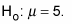

# P-Value and hypothesis test

## Hypothesis test

Hypothesis test are setup to determine the validity of a statistical claim. Every hypothesis test contains two sets of opposing statements/hypothesis:

* Null Hypothesis
* Alternative Hypothesis

### Null Hypothesis

The null hypothesis states that the _population parameter_ is equal to the _claimed value_. For example, if the claim is that average time to cook pizza is 5 minutes, the notation for null hypothesis would be:

### Alternative Hypothesis

You need to define an opposing statement/hypothesis, in cases where null hypothesis fails. There can be three possibilities for an alternative hypothesis.

1. The population parameter is _not equal_ to the claimed value
2. The population parameter is _greater than_ the claimed value
3. The population parameter is _less than_ the claimed value

## P-Value

P-value is used as the cutoff point for rejecting the null hypothesis. A greater p-value means there is stronger evidence in the favor of the null hypothesis.

In a statistical hypothesis test, p-value is the level of marginal significance representing a given event's probability of occurrence.

The p-value is a number between 0 and 1 and interpreted in the following way:

* A small p-value \(typically ≤ 0.05\) indicates strong evidence against the null hypothesis, so you _reject_ the null hypothesis.
* A large p-value \(&gt; 0.05\) indicates weak evidence against the null hypothesis, so you _fail to reject_ the null hypothesis.
* p-values very close to the cutoff \(0.05\) are considered to be marginal \(could go _either way_\). 

**Note**: _Always report the p-value so your readers can draw their own conclusions._

Link:  
[https://www.dummies.com/education/math/statistics/what-a-p-value-tells-you-about-statistical-data/](https://www.dummies.com/education/math/statistics/what-a-p-value-tells-you-about-statistical-data/)

