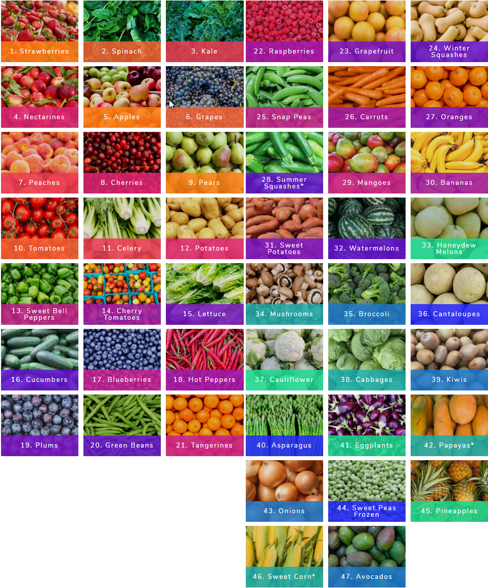

# 2019 Guide to Pesticides in Produce

> More than 92 percent of kale samples had two or more pesticide residues detected

The following list helps buyer to decide when to opt for Organic choices:

## EWG'S DIRTY DOZEN FOR 2019

1. Strawberries
2. Spinach
3. Kale
4. Nectarines
5. Apples
6. Grapes
7. Peaches
8. Cherries
9. Pears
10. Tomatoes
11. Celery
12. Potatoes

## **EWG'S CLEAN FIFTEEN FOR 2019**

1. Avocados
2. Sweet corn
3. Pineapples
4. Frozen sweet peas
5. Onions
6. Papayas
7. Eggplants
8. Asparagus
9. Kiwis
10. Cabbages
11. Cauliflower
12. Cantaloupes
13. Broccoli
14. Mushrooms
15. Honeydew melons

Link:   
- Article: [https://www.ewg.org/foodnews/full-list.php](https://www.ewg.org/foodnews/full-list.php)  
- Full size image: [https://imgur.com/a/X79reCd](https://imgur.com/a/X79reCd)  

