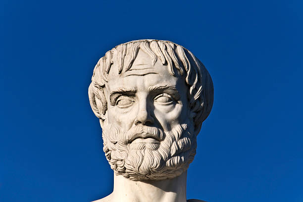

# Aristotle's Defense of Private Property

**Private property** is a critical issue which **modern capitalists** supports on the grounds of efficiency. **Socialists**, on the other hand critique it.

**Aristotle** was a polymath who wrote extensively on ethics, logic, metaphysics, biology, astronomy, rhetoric, and more.

Aristotle demonstrated the superiority of private property in four core areas:

### Efficiency

When people are sharing something, Aristotle claims, everyone is more likely to assume that someone else will take care of it instead of taking responsibility themselves.

People have an incentive to be productive with what they are uniquely responsible for since they will benefit directly from their own efforts.

### Unity

Association is not a bad thing by any means, but having people share essential resources opens the door to potential conflict.

### Justice

For Aristotle, justice constitutes being rewarded what you are worth, therefore unequal abilities result in unequal rewards. He believed that in a system of communal ownership, problems are bound to arise where some people work more than others yet receive the same reward.

### Virtue

Aristotle believed virtue to be an act of doing favors and helping others freely. But if everyone communally owns everything, no one can give something of their own to someone else. 

Coercion of communal property nullifies the individual’s possibility for virtue because it removes personal choice.

Link:  
[https://medium.com/s/story/aristotles-defence-of-private-property-954a113f4443](https://medium.com/s/story/aristotles-defence-of-private-property-954a113f4443)

