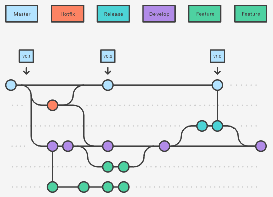

# Comparing Git Workflow

Link: [https://www.atlassian.com/git/tutorials/comparing-workflows/gitflow-workflow](https://www.atlassian.com/git/tutorials/comparing-workflows/gitflow-workflow)

What I use at work \(NLM\): [Gitflow Workflow](https://www.atlassian.com/git/tutorials/comparing-workflows/gitflow-workflow)  
  
-- Master branch  
    \|-- Develop branch  
         \|-- Feature branch   
         \|-- Release branch  
    \|-- Hotfix  
       

