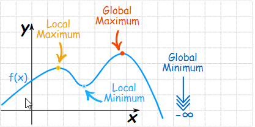
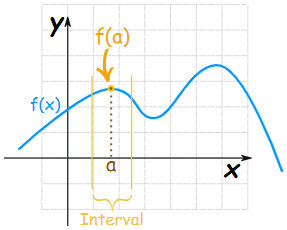
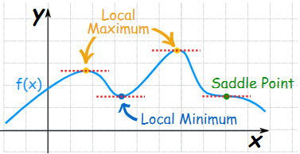

# Maxima and Minima using Derivatives

A maximum is a high point and a minimum is a low point.

* The plural of Maximum is **Maxima**
* The plural of Minimum is **Minima**
* Maxima and Minima are collectively called **Extrema**

### Local Maximum or Local Minimum 

 **First** we need to choose an interval:

The local **maximum** is the point where the height of the function at "a" is greater than \(or equal to\) the height anywhere else in that interval.

**Local Maximum**: $$ f(a) ≥ f(x)$$ for all x in the interval  
**Local Minimum**: $$ f(a) ≤ f(x)$$ for all x in the interval

### Global \(or Absolute\) Maximum and Minimum

The maximum or minimum over the **entire function** is called an "Absolute" or "Global" maximum or minimum. There is **ONLY** one **global maximum** and one **global minimum**.

## Finding Maxima and Minima using Derivatives

In a smoothly changing function a **maximum** or **minimum** is always where the function **flattens out**  except for a **saddle point \(**A stationary point but not an extremum\).

**Note:** When a function **flattens out**, the **slope** is **zero**. **Derivatives** is helpful to find where the **slope** is **zero**.

### **Steps to Find the maxima and minima for**: $$y = 5x^3 + 2x^2 − 3x$$

1. Given a function $$y =  f(x) = 5x^3 + 2x^2 − 3x$$
2. Find slope of $$f(x)$$ using derivatives $$\frac{df}{dx}$$

   $$f'(x) = \frac{df}{dx} =  15x^2 + 4x − 3 $$ .....\(i\)

3. Slope is **zero** at extrema. So, use $$\frac{df}{dx} = 0$$ to solve for x. This would give the position of x-coordinates the local minima or maxima  Solve: $$15x^2 + 4x − 3  = 0$$  The above equation is a quadratic \( $$ax^2+bx+c=0$$ \)    $$x = -\frac{3}{5}; x = \frac{1}{3}$$  
4. Take a **second derivative** of the first slope $$\frac{d}{dx}(\frac{df}{dx})$$  Note: First slope can be found from Step 2 $$f''(x) = \frac{d( 15x^2 + 4x − 3 )}{dx} = 30x+4$$
5. If the **second derivative is:**

   1. less than 0, it is a local maximum
   2. greater than 0, it is a local minimum
   3. equal to 0, then the test fails \(Could be a saddle point\)

  
   **At** $$x = -\frac{3}{5}$$   
   ****$$ f''(x) = 30(-\frac{3}{5}) + 4 = −14$$  
   which is less than 0, so local maximum is at $$x = -\frac{3}{5}$$

  

   **At** $$x = \frac{1}{3}$$   
   $$ f''(x) = 30(\frac{1}{3}) + 4 = 14$$  
   which is greater than 0, so local maximum is at $$x = \frac{1}{3}$$

## Concavity

Taking the derivative f'\(x\) of a function f\(x\) gives the slope.

* When the slope continually **increases**, the function is **concave upward**.
* When the slope continually **decreases**, the function is **concave downward**.

Using the **second derivative** f''\(x\):

* When the second derivative is **positive**, the function is **concave upward**.
* When the second derivative is **negative**, the function is **concave downward**.

Link:  
- [MathsIsFun: Maxima and Minima of Functions](https://www.mathsisfun.com/algebra/functions-maxima-minima.html)  
- [MathsIsFun: Finding Maxima and Minima using Derivatives](https://www.mathsisfun.com/calculus/maxima-minima.html)  
- KhanAcademy: [Maxima, Minima and Saddle Points](https://www.khanacademy.org/math/multivariable-calculus/applications-of-multivariable-derivatives/optimizing-multivariable-functions/a/maximums-minimums-and-saddle-points)  
- KhanAcademy: [Concavity](https://www.khanacademy.org/math/ap-calculus-ab/ab-diff-analytical-applications-new/ab-5-6a/v/concavity-concave-upwards-and-concave-downwards-intervals)

