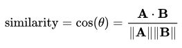

# Cosine Similarity

The **cosine similarity** between two vectors is a measure that calculates the cosine of the angle between them.

Cosine similarity focuses on the direction instead of magnitude which is helpful in NLP and sentiment analysis. Longer document can have same **theme** as short sentences.



Three different angle between two vectors:  
i\) 90 degree \(Orthogonal\): **NOT** similar or Independent  
ii\) Less than 90 degree: **Similar**  
iii\) Greater than 90 degree: **Opposite**

**Note:**  
_- Words and sentences should be converted to vectors to calculate cosine similarity  
- Tools such as **Word2Vec**, bag of words with either **TF**\(term frequency\) or **TF-IDF**\(term frequency-inverse document frequency\) can be used_

### Calculate Cosine Similarity using Scikit-learn

```python
documents = ("The sky is blue",
"The sun is bright",
"The sun in the sky is bright",
"We can see the shining sun, the bright sun"
)

# import TF-IDF Vectorizer
from sklearn.feature_extraction.text import TfidfVectorizer
from sklearn.metrics.pairwise import cosine_similarity​

# Instantiate SKlearn TF-Vectorizer and transform document into TF-IDF matrix
tfidf_vectorizer = TfidfVectorizer()
tfidf_matrix = tfidf_vectorizer.fit_transform(documents)
tfidf_matrix.shape # Prints (4,11): 4 sentences, 11 unique words

# Calculate cosine similarity between the first document with each of the other document
display(cosine_similarity(tfidf_matrix[0:1], tfidf_matrix))
```

```text
array([[1.        , 0.36651513, 0.52305744, 0.13448867]])
```

Link: [http://blog.christianperone.com/2013/09/machine-learning-cosine-similarity-for-vector-space-models-part-iii/](http://blog.christianperone.com/2013/09/machine-learning-cosine-similarity-for-vector-space-models-part-iii/)

