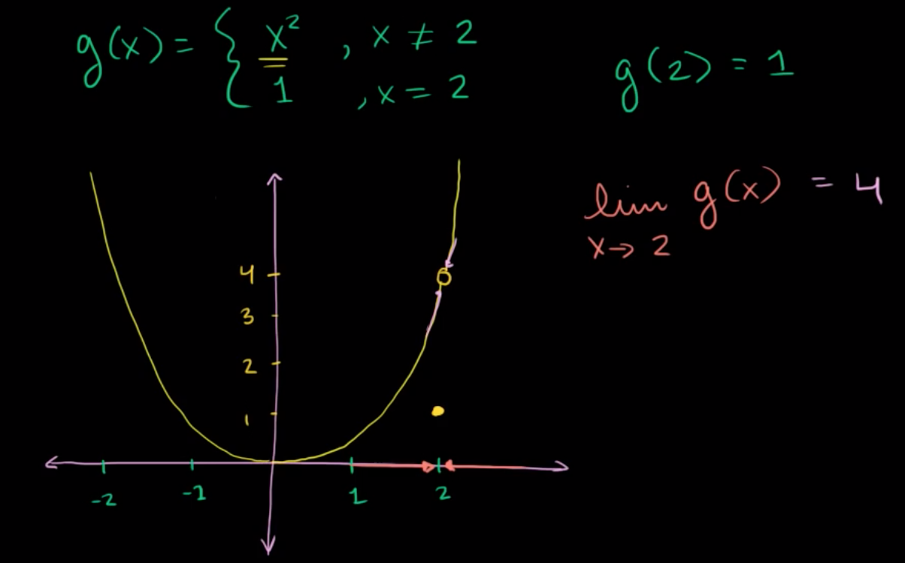
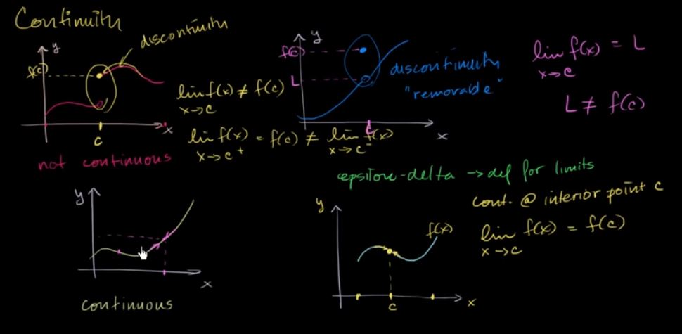

# Functions

An equation will be a **function** if, for any $$x$$ in the domain of the equation \(the domain is all the $$x$$’s that can be plugged into the equation\), the equation will yield exactly one value of $$y$$ when we evaluate the equation at a specific $$x$$.

**Single variable** calculus deals with functions of one variable, **multivariable** calculus deals with functions of multiple variables.

$$
Single\hspace{0.1cm}variable\hspace{0.1cm}function:\hspace{0.1cm}f(x) = x^2+2x+1
\newline
Multi\hspace{0.1cm}variable\hspace{0.1cm}function:\hspace{0.1cm}f(x,y)=x^2 +2xy+y^2
$$

### Limits

A limit is the value **f\(a\)** that a function **f\(x\)** approaches as that function’s inputs **'x'** get closer and closer to some number **'a'**. The idea of a limit is the basis of all calculus.

$$
\lim_{x\to a} f(x) = f(a)
$$

In the following example, the limit of a function $$g(x)$$ as the input $$x$$approaches 2 is a value 4.

### Continuity

A function f\(x\) is continuous on a set if the graph of f is a connected curve without any jumps, gaps, or holes. 

Continuity can be defined using the concept of limits where a continuous function will satisfy the following equation:

$$
\lim_{x\to c} f(x) = f(c)
$$

Link:

* [3Blue1Brown Video: Essence of Calculus \(~17mins\)](https://www.youtube.com/watch?v=WUvTyaaNkzM)
* [Khan Academy: Introduction to Limits \(~13mins\)](https://www.youtube.com/watch?v=riXcZT2ICjA)
* [Khan Academy: Continuity Introduction \(~12mins\)](https://www.khanacademy.org/math/in-in-grade-12-ncert/in-in-continuity-differentiability/copy-of-continuity-at-a-point-ab/v/limits-to-define-continuity)

