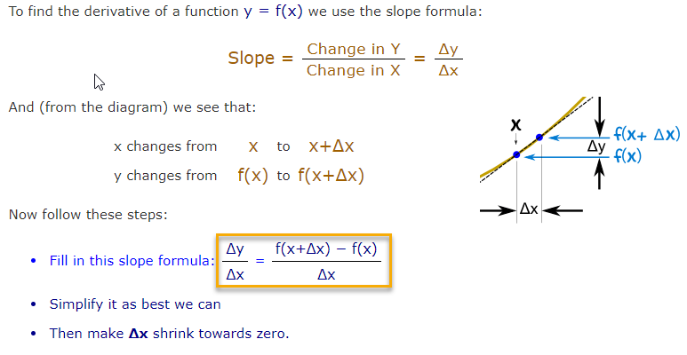
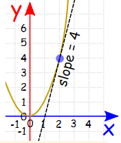

# Scalar Derivative

In calculus, **derivative** can be approached in two different ways. One is geometrical \(as a **slope of a curve**\) and the other one is physical \(as a **rate of change**\). ****The process of finding a **derivative** is called "**differentiation**"

**'The derivative of'** is commonly written as $$\frac{d}{dx}$$ or $$f'(x)$$

### Find a Derivative

#### Example:

$$\frac{d}{dx}x^2 = 2x$$

means the slope or "rate of change" at any point in the graph/function $$x^2$$  is **2x**. So when **x=2** the slope is **2x = 4**

### Scalar derivative rules 

Link:  
[- Matrix Calculus For Deep Learning](https://explained.ai/matrix-calculus/index.html)  
- [MathIsFun: Introduction to Derivatives](https://www.mathsisfun.com/calculus/derivatives-introduction.html)  
[- Khan Academy: Basic Derivative Rules](https://www.khanacademy.org/math/old-ap-calculus-ab/ab-derivative-rules)

