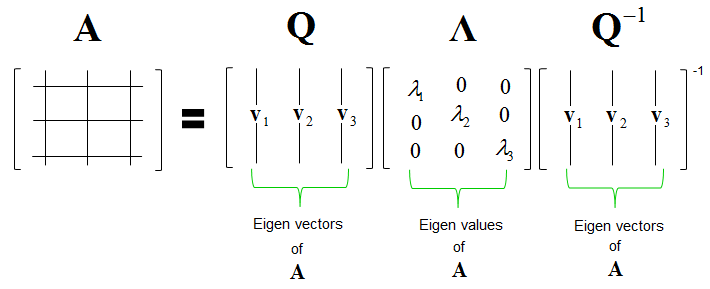

# Eigendecomposition, Eigenvectors and Eigenvalues

## Eigendecomposition

**Eigendecomposition**\(_pronounced eye-gan_\) of a matrix is a type of decomposition that involves decomposing a square matrix into a set of **eigenvectors** and **eigenvalues**.

**Note:** Decomposition does **NOT** result in a _compression_ of the matrix; **instead**, it breaks it down into constituent parts to make certain operations on the matrix easier to perform.

$$A$$ : Parent square matrix  
$$Q$$ : Matrix comprised of the eigenvectors  
$$\Lambda$$: Diagonal matrix comprised of the eigenvalues  
$$Q^{-1}$$: Inverse of the matrix comprised of the eigenvectors

## Eigenvectors and Eigenvalues

An **eigenvector** is a vector whose direction remains unchanged when a linear transformation is applied to it. The factor by which an eigenvector is stretched or squished after a linear transformation is known as **eigenvalue**.

The eigenvalue lambda tells whether the special vector x is stretched or shrunk or reversed\(negative value\) or left unchanged.

**Eigenvector** of a matrix must satisfy the following equation:

$$
A . \vec{v} = \lambda . \vec{v}
\newline
Matrix-vector\hspace{0.1cm}multiplication\hspace{0.2cm}Vs\hspace{0.2cm}Scalar-vector\hspace{0.1cm}multiplication
\newline
Convert\hspace{0.1cm}scalar \lambda\hspace{0.1cm}to\hspace{0.1cm}Matrix\hspace{0.1cm}: \lambda.I(Identity Matrix)
\newline
A . \vec{v} = (\lambda I) . \vec{v}\newline
A . \vec{v} - (\lambda I) . \vec{v} = \vec{0}
\newline
(A - \lambda I) . \vec{v} = \vec{0}
$$

$$A$$ : Parent square matrix  
$$\vec{v}$$ : Eigenvector of the matrix  
$$\lambda$$: Scalar eigenvalue

For eigenvector $$\vec{v}$$ to be non-zero, the only possible solution where a matrix\($$A$$-$$\lambda$$$$I$$\) and vector \($$\vec{v}$$\) multiplication that results in zero is during _squishification. i.e det\(matrix\) = 0 or_  $$det(A - \lambda I) = 0$$ 

### **Positive and negative definite matrix**

A matrix that has only positive eigenvalues is referred to as a positive definite matrix, whereas if the eigenvalues are all negative, it is referred to as a negative definite matrix.

## Calculate an eigendecomposition with NumPy

## Confirm a vector is an eigenvector

## Reconstruct a matrix from eigenvectors and eigenvalues

Link:

* [Video: 3Blue1Brown](https://www.youtube.com/watch?v=PFDu9oVAE-g)
* [Video: What are Eigenvalues and Eigenvectors?](https://www.coursera.org/lecture/linear-algebra-machine-learning/what-are-eigenvalues-and-eigenvectors-oPBNY)
* [Computer Vision for dummies: Eigenvalues and Eigenvectors](http://www.visiondummy.com/2014/03/eigenvalues-eigenvectors/)
* [Machine Learning Mastery](https://machinelearningmastery.com/introduction-to-eigendecomposition-eigenvalues-and-eigenvectors/)

