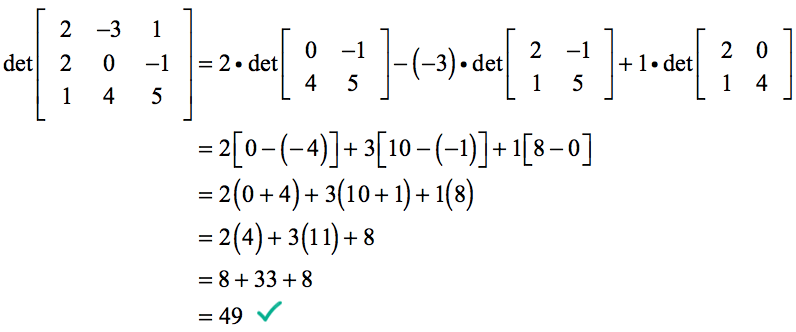

# Matrix Operations

**Matrix operations** are used in many machine learning algorithms. Linear algebra makes matrix operations fast and easy, especially when training on GPUs.

## Transpose

A transpose is a _matrix_ which is formed by turning all the rows of a given _matrix_ into columns and vice-versa represented as `A^T`.

$$
A=\begin{bmatrix}
a_{11} \hspace{0.2cm} a_{12}
\\ a_{21} \hspace{0.2cm} a_{22}
\\ a_{31} \hspace{0.2cm} a_{32}
\end{bmatrix}, 
A^T=\begin{bmatrix}
a_{11} \hspace{0.2cm} a_{21}\hspace{0.2cm} a_{31}
\\ a_{12} \hspace{0.2cm} a_{22}\hspace{0.2cm} a_{32}
\end{bmatrix}
$$

```python
from numpy import array
A = array([[1, 2], [3, 4], [5, 6]])
C = A.T
print(C)
```

```text
[[1 3 5]
 [2 4 6]]
```

## Inversion

**Matrix inversion** is a process that finds another matrix that when multiplied with the matrix, results in an **identity matrix** \(1's in main diagonal, zeros everywhere else\) ****represented as **`AB = BA = I`**

**Note:** A square matrix that is not invertible is referred to as **singular**. The matrix inversion operation is not computed directly, but rather the inverted matrix is discovered through forms of matrix decomposition.

$$
B = A^{-1},  I=\begin{bmatrix}
1\hspace{0.2cm} 0\hspace{0.2cm}..  \hspace{0.2cm}0
\\0\hspace{0.2cm} 1\hspace{0.2cm}..  
\hspace{0.2cm}0
\\ .. ..
\\ 0\hspace{0.2cm} 0\hspace{0.2cm}..  \hspace{0.2cm}1
\end{bmatrix}
$$

```python
from numpy import array
from numpy import dot
from numpy.linalg import inv
A = array([[4,3], [3,2]])
B = inv(A)
print(B)
product = dot(A,B)
print(product)​
```

```text
[[-2.  3.]
 [ 3. -4.]]
[[1. 0.]
 [0. 1.]]
```

## Trace

A trace of a square matrix is the sum of the values on the main diagonal of the matrix represented as **`tr(A)`**

$$
A=\begin{bmatrix}
a_{11} \hspace{0.2cm} a_{12} \hspace{0.2cm} a_{13}
\\ a_{21} \hspace{0.2cm} a_{22} \hspace{0.2cm} a_{23}
\\ a_{31} \hspace{0.2cm} a_{32} \hspace{0.2cm} a_{33}
\end{bmatrix},
tr(A) = a_{11} + a_{22} + a_{33}
$$

```python
from numpy import array
from numpy import trace
A = array([[1, 2, 3], [4, 5, 6], [7, 8, 9]])
B = trace(A)
print(B)
```

```text
15
```

## Determinant

The determinant of a square matrix is a scalar representation of the volume of the matrix represented as **`|A| or det(A)`**

**Note: T**he determinant is the product of all the **eigenvalues** of the matrix. Also, a determinant of **0** indicates that the matrix **cannot** be **inverted**.



```python
from numpy import array
from numpy.linalg import det
A = array([[2, -3, 1], [2, 0, -1], [1, 4, 5]])
B = det(A)
print(B)
```

```text
49.000000000000014
```

## Rank

**Calculating rank mathematically:**  
[https://www.youtube.com/watch?v=59z6eBynJuw](https://www.youtube.com/watch?v=59z6eBynJuw)

Link:  
[https://machinelearningmastery.com/matrix-operations-for-machine-learning/](https://machinelearningmastery.com/matrix-operations-for-machine-learning/)

