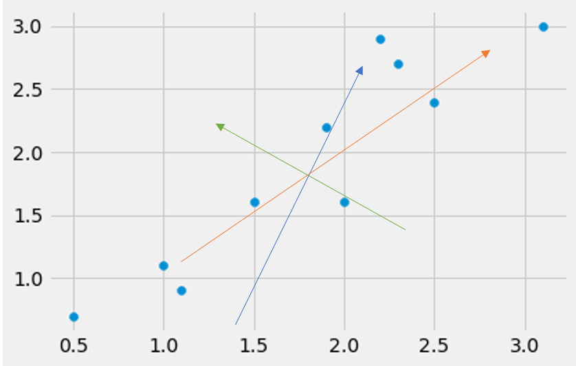

# Principle Component Analysis \(PCA\)

**Principal Component Analysis**\(PCA\) is a method for reducing the _dimensionality_ of data. It is the process of finding the principal components of a dataset with n-columns \(features\) and projecting it into a subspace with fewer columns, whilst retaining the essence of the original data.

The first principal component of a dataset is the direction along the dataset with the highest variation. In the example shown below, the orange arrow points into the direction with the largest variance.



### Steps to find PCA

1. Collect the data
2. Normalize the data
3. Calculate the covariance matrix
4. Find the eigenvalues and eigenvectors of the covariance matrix
5. Use the principal components to transform the data - Reduce the dimensionality of the data 

## Manually Calculate Principal Component Analysis

**Steps:**

* Get the original matrix
* Note: Transpose the original matrix\(row x column\) to group columns together for calculation
* Calculate mean of each column which is grouped together
* Subtract original matrix columns by subtracting column mean to get a **centered** matrix
* Calculate **covariance** of centered matrix
* Find eigenvalues and eigenvectors using eigendecomposition
  * Select k eigenvectors, called **principal components**, that have the k largest eigenvalues
* Find projection `P = B^T . C`

  Where C is the normalized/centered matrix that we wish to project, B^T is the transpose of the chosen principal components and P is the projection of A.

Note: In the following example, we can see that only the first eigenvector is required, suggesting that we could project our 3×2 matrix onto a 3×1 matrix with little loss.

```python
from numpy import array
from numpy import dot
from numpy import mean
from numpy import cov
from numpy.linalg import eig

A = array([[1, 2], [3, 4], [5, 6]])
print('Printing original A')
print(A)

# Regroup column/feature i and column/feature ii together by transposing
# feature i: 1,3,4
# feature ii: 2,4,6
print('------------------')
print('Printing A.T which regroups column data together')
print(A.T)

# calculate the mean of each row (axis=1) i.e Transposed/grouped columns
M = mean(A.T, axis=1)
print('------------------')
print('Printing mean')
print(M)

# center columns by subtracting column means
# Also regroup column/feature i and column/feature ii together by transposing the centered matrix
C = (A - M).T
print('------------------')
print('Printing normalized/centered matrix that was transposed to regroup column data together')
print(C)
​
# calculate covariance of matrix(normalized/centered)
print('------------------')
print('Printing covariance of matrix')
V = cov(C)
print(V)

# eigendecomposition of covariance matrix
values, vectors = eig(V)
print('------------------')
print('Printing eigenvalues')
print(values)
​
print('------------------')
print('Printing eigenvectors')
print(vectors)
​
# project data on centered matrix
# projection and all the above calculation is done by grouping column together
# Note: The final matrix has to be transposed back to its row * column form
P = vectors.T.dot(C)
print('------------------')
print('Printing projection')
print(P.T)
```

```text
Printing original A
[[1 2]
 [3 4]
 [5 6]]
------------------
Printing A.T which regroups column data together
[[1 3 5]
 [2 4 6]]
------------------
Printing mean
[3. 4.]
------------------
Printing normalized/centered matrix that was transposed to regroup column data together
[[-2.  0.  2.]
 [-2.  0.  2.]]
------------------
Printing covariance of matrix
[[4. 4.]
 [4. 4.]]
------------------
Printing eigenvalues
[8. 0.]
------------------
Printing eigenvectors
[[ 0.70710678 -0.70710678]
 [ 0.70710678  0.70710678]]
------------------
Printing projection
[[-2.82842712  0.        ]
 [ 0.          0.        ]
 [ 2.82842712  0.        ]]
```

## Principle Component Analysis using scikit-learn library

**PCA** can be calculated using **scikit-learn** library.  
  
**Steps:**

* Define a matrix
* Create the PCA instance with number of components as parameter
* Fit on data
* Find eigenvalues and eigenvectors using eigendecomposition
* Project data Note: In the projection, the value `2.22044605e-16` is very close to 0.

```python
from numpy import array
from sklearn.decomposition import PCA

A = array([[1, 2], [3, 4], [5, 6]])
print('------------------')
print('Printing A')
print(A)

# create PCA instance with number of components as parameter
pca = PCA(2)

# fit on data
pca.fit(A)
# access eigenvalues and eigenvectors
print('------------------')
print('Printing eigenvectors')
print(pca.components_)

print('------------------')
print('Printing eigenvalues')
print(pca.explained_variance_)

# note: the eigenvector printed in the previous manual calculation was a transpose
print('------------------')
print('Printing eigenvalues.transpose')
print(pca.components_.T)

# project/transform
P = pca.transform(A)
print('------------------')
print('Printing projection')
print(P)​
```

```text
------------------
Printing A
[[1 2]
 [3 4]
 [5 6]]
------------------
Printing eigenvectors
[[ 0.70710678  0.70710678]
 [-0.70710678  0.70710678]]
------------------
Printing eigenvalues
[8. 0.]
------------------
Printing eigenvalues.transpose
[[ 0.70710678 -0.70710678]
 [ 0.70710678  0.70710678]]
------------------
Printing projection
[[-2.82842712e+00 -2.22044605e-16]
 [ 0.00000000e+00  0.00000000e+00]
 [ 2.82842712e+00  2.22044605e-16]]
```

Link:

* [Principle Component Analysis](https://www.python-course.eu/principal_component_analysis.php)
* [How to Calculate Principal Component Analysis \(PCA\) from Scratch in Python](https://machinelearningmastery.com/calculate-principal-component-analysis-scratch-python/)
* [Youtube Video: PCA \(~26mins\)](https://www.youtube.com/watch?v=g-Hb26agBFg)

