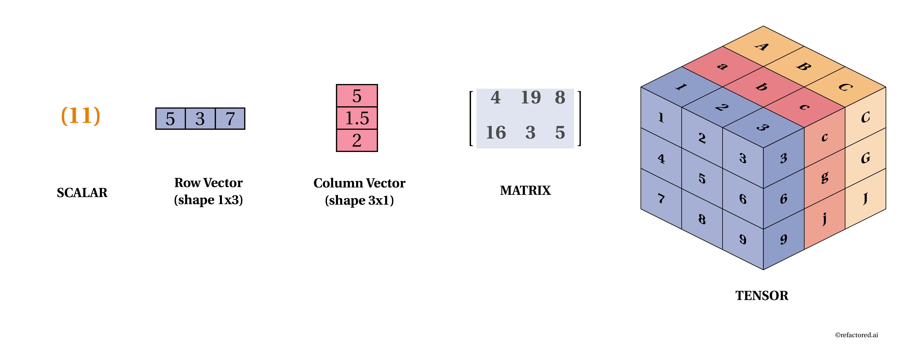

# Vectors



## **Scalars**

Scalars are single numbers.  
Example: x ∈ R denotes that the scalar value x is a member of real valued numbers R.

## Vector

**Vector** in Machine Learning is a collection/array of numbers that corresponds to some features. 

Example:  \[2,5,1\] may be used to classify an apple where the first, second and third values represent features such as size, color and number of seeds in a fruit respectively.

Vector in Python can be represented as a NumPy array.

```python
from numpy import array
v = array([2, 5, 1])
print(v)
```

```bash
## Output
[2 5 1]
```

### Vector Arithmetic <a id="Vector-Arithmetic"></a>

Two vectors of equal length can be added, subtracted, divided or multiplied with each other to result in a new vector with the same length.

If `a = [a1, a2, a3]` and b = `[b1, b2, b3]` then the following operation will yield:

a\) **Addition**: `c = [a1+b1, a2+b2, a3+b3]`

b\) **Subtraction**: `c = [a1-b1, a2-b2, a3-b3]`

c\) **Division**: `c = [a1/b1, a2/b2, a3/b3]`

d\) **Multiplication**: `c = [a1*b1, a2*b2, a3*b3]`

```python
# Vector Arithmetic
a = array([10, 20, 30])
b = array([5, 10, 15])

addition = a + b
subtraction = a - b
division = a / b
multiplication = a * b

# print result
print(addition)
print(subtraction)
print(division)
print(multiplication)
```

```bash
[15 30 45]
[ 5 10 15]
[2. 2. 2.]
[ 50 200 450]
```

### Vector Scalar Multiplication <a id="Vector-Scalar-Multiplication"></a>

Vector can be multiplied by a scalar value. This results in scaling the magnitude of a vector.

If `a = [a1, a2, a3]` and `s = scalar`

**Vector Scalar Multiplication**: `c = [s*a1, s*a2, s*a3]`

```python
# Vector Scalar Multiplication
a = array([10, 20, 30])
s = 0.5

vsmulti = s * a
print(vsmulti)
```

```bash
[ 5. 10. 15.]
```

### Vector Dot Product <a id="Vector-Dot-Product"></a>

Vector dot product is a number/value obtained by adding the multiplied elements of two vectors of the same length. Named after the dot\(period\) operator which describes it.

If `a = [a1, a2, a3]` and `b = [b1, b2, b3]` then

**Vector Dot Product**: `c = a . b = (a1*b1 + a2*b2 + a3*b3)`

Note: The dot product is an important tool for calculating vector projections, determining orthogonality, etc.

```python
# Vector Scalar Multiplication
a = array([1, 2, 3])
b = array([1, 2, 3])

dotProduct = a.dot(b)
print(dotProduct)
```

```bash
14
```

#### Alternate method: Vector Dot Product

```python
import numpy as np
np.vdot(a,b)
```

```text
14
```

