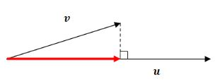

# Vector Projection

### Trigonometry

sin Θ = p/h, cos Θ = b/h, tan Θ = p/b  
where p: perpendicular, h: hypotenuse, b:base

**Vector projection** for the indicated red vector is read as the vector projection of v onto u. \(Imagine projecting a long light beam parallel to v which casts a shadow onto u\)

### Finding Scalar Projection

Scalar projection is the scalar value of the red line without taking direction into consideration.

$$
cosθ = ScalarProjection / |v|
$$

After solving the mathematical equations:

$$
Scalar Projection = \frac{u⋅v}{ |u|}
$$

$$
Vector Projection = (\frac{u⋅v}{ |u|}) \frac{u}{ |u|}
$$

Note: Vector Projection is simply a product of multiplying scalar projection with a unit vector u in the same direction as u.  
**u.v**: vector dot product  
**\|u\|**: length of **u**

Link: [https://en.m.wikipedia.org/wiki/Vector\_projection](https://www.ck12.org/book/CK-12-Precalculus-Concepts/section/7.5/)

