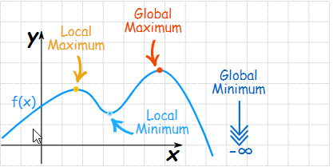
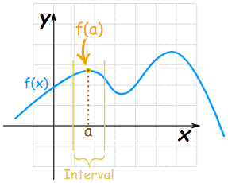
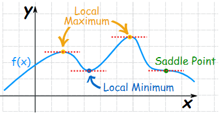

# Maxima and Minima using Derivatives

A maximum is a high point and a minimum is a low point.

* The plural of Maximum is **Maxima**
* The plural of Minimum is **Minima**
* Maxima and Minima are collectively called **Extrema**

### Local Maximum or Local Minimum 

 **First** we need to choose an interval:

The local **maximum** is the point where the height of the function at "a" is greater than \(or equal to\) the height anywhere else in that interval.

**Local Maximum**: $$ f(a) ≥ f(x)$$ for all x in the interval  
**Local Minimum**: $$ f(a) ≤ f(x)$$ for all x in the interval

### Global \(or Absolute\) Maximum and Minimum

The maximum or minimum over the **entire function** is called an "Absolute" or "Global" maximum or minimum. There is **ONLY** one **global maximum** and one **global minimum**.

## Finding Maxima and Minima using Derivatives

In a smoothly changing function a **maximum** or **minimum** is always where the function **flattens out**  except for a **saddle point \(**A stationary point but not an extremum\).

**Note:** When a function **flattens out**, the **slope** is **zero**. **Derivatives** is helpful to find where the **slope** is **zero**.

Link:  
- [MathsIsFun: Maxima and Minima of Functions](https://www.mathsisfun.com/algebra/functions-maxima-minima.html)  
- [MathsIsFun: Finding Maxima and Minima using Derivatives](https://www.mathsisfun.com/calculus/maxima-minima.html)  
- KhanAcademy: [Maxima, Minima and Saddle Points](https://www.khanacademy.org/math/multivariable-calculus/applications-of-multivariable-derivatives/optimizing-multivariable-functions/a/maximums-minimums-and-saddle-points)

