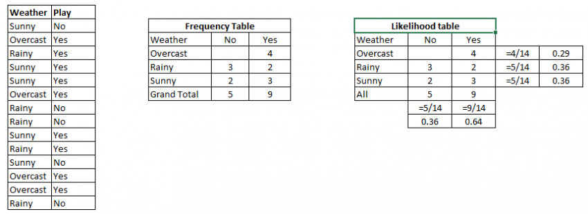

# MLE, MAP, and Naive Bayes

### Bayes' Theorem

Bayes' Theorem provides a way that we can calculate the posterior probability of a class/hypothesis/target P\(c\|x\) given our prior knowledge of P\(c\), P\(x\) and P\(x\|c\).

$$
P(c|x) = \frac{P(x|c)P(c)}{P(x)}
$$

* P\(c\|x\): The **posterior probability** of class \(c, target\) given predictor \(x, attributes\).
* P\(c\): The **prior probability** of class
* P\(x\|c\): The **likelihood** which is the probability of predictor given class
* P\(x\): is the **prior probability** of predictor

### Naive Bayes

**Classification** technique based on **Bayes’ Theorem** with an assumption of independence among predictors. It is called _**naive** Bayes_ or _**idiot** Bayes_ because it simplifies the calculation by assuming a particular feature in a class is unrelated to the presence of any other features.

**Sample Problem:** Players will play if weather is sunny. Is this statement is correct?

Step 1: Convert the data set into a frequency table

Step 2: Create Likelihood table by finding the probabilities like Overcast probability = 0.29 and probability of playing is 0.64

Step 3: Now, use Naive Bayesian equation to calculate the posterior probability for each class. The class with the highest posterior probability is the outcome of prediction.

**Problem:** Players will play if weather is sunny. Is this statement is correct?

We can solve it using above discussed method of posterior probability.

P\(Yes \| Sunny\) = P\( Sunny \| Yes\) \* P\(Yes\) / P \(Sunny\)

Here we have P \(Sunny \|Yes\) = 3/9 = 0.33, P\(Sunny\) = 5/14 = 0.36, P\( Yes\)= 9/14 = 0.64

Now, P \(Yes \| Sunny\) = 0.33 \* 0.64 / 0.36 = 0.60, which has higher probability.

### Maximum a posteriori \(MAP\)

**MAP** estimation is the value of the parameter that maximizes the entire posterior distribution \(which is calculated using the likelihood\). A MAP estimate is the mode/max of the posterior distribution.  
  
After calculating the posterior probability P\(c\|x\) for a number of different classes/hypotheses \(e.g: P\(Yes \| Sunny\), P\(No \| Sunny\) where 'Yes' and 'No' are two classes for the above example\), you can select the hypothesis with the highest probability. 

$$
MAP = max(P(c|x))
$$

### Maximum likelihood estimate \(MLE\)

**MLE** of a parameter is the value of the parameter that maximizes the **likelihood function** of the unknown parameters given observed data.

$$
MLE = max(P(x|c))
$$

Note: **MLE = MAP** if the prior distribution we were assuming was a constant.

Link:  
- [https://machinelearningmastery.com/naive-bayes-for-machine-learning/](https://machinelearningmastery.com/naive-bayes-for-machine-learning/)  
- [http://blog.christianperone.com/2019/01/a-sane-introduction-to-maximum-likelihood-estimation-mle-and-maximum-a-posteriori-map/](http://blog.christianperone.com/2019/01/a-sane-introduction-to-maximum-likelihood-estimation-mle-and-maximum-a-posteriori-map/)  
- [https://www.analyticsvidhya.com/blog/2017/09/naive-bayes-explained/](https://www.analyticsvidhya.com/blog/2017/09/naive-bayes-explained/)

